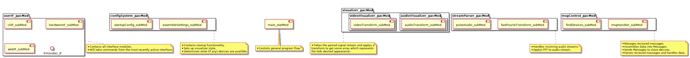

# Audio-Oxide

## Summary / Motivation
A music visualizer based on the audio-reactive-led-strip python project by scottlawson.

This project was originally implemented in python for and supported esp8266-PC, esp8266-Raspberry Pi, and standalone Raspberry Pi implementation. While this was originally written in python this project will use the python project as the starting point for a similar implementation in Rust. 

The motivation here is as follows : 

* To learn about using Rust in a real-world signal processing and embedded setting.
* To provide audio signal processing with better performance than was originally benchmarked in the original, python based project.
* To create a more flexible and robust implementation that may be utilized on a wide range of devices.

## Requirements

To guide this project along a set of requirements will be created. Note that this will be updated as the project progresses and the state meets the currently set requirements. 
This implys that so until we reach a beta release this project will not satisfy **all** of the requirements.

For the purposes of this list "the program" refers to entire projects implementation (aka both the hardware and software implementation).

* The program should be able to discern between good input and blad input.
    * White noise vs legitimate audio input.
* The program should be able to switch between mutiple types of audio inputs.
    * Tv audio, laptop audio, Phono audio, mic input.
* The program should be able to run completely on embedded hardware.
    * That is the signal processing should not have to be done on the PC and ideally would not even require a Raspberry Pi.
* The program should be able to send commands to a number of seperate led control devices wirelessly and in a synchronized fashion.
    * Essentially the signal processing will be done on one device and then the led control messages will be sent to a number of devices which will then take the message and drive the leds as desired.

## System Design

### Hardware

### Software

#### General Syntax rules

##### Modules & Classes

Modules are used to store a collection of classes. These modules are named to indicate their relationship with other modules.

* Modules containing other modules within themselves are denoted with _pacMod.
* Modules which are contained within a _pacMod are denoted with _subMod.
* Modules which are standalone (meaning they do not contain other modules and are not contained within other modules) are denoted with _statMod.
* Modules which may be standalone but may change are denoted with _dynMod.

#### Master Software Design

#### Module Component Diagram

#### Slave Device Software Design